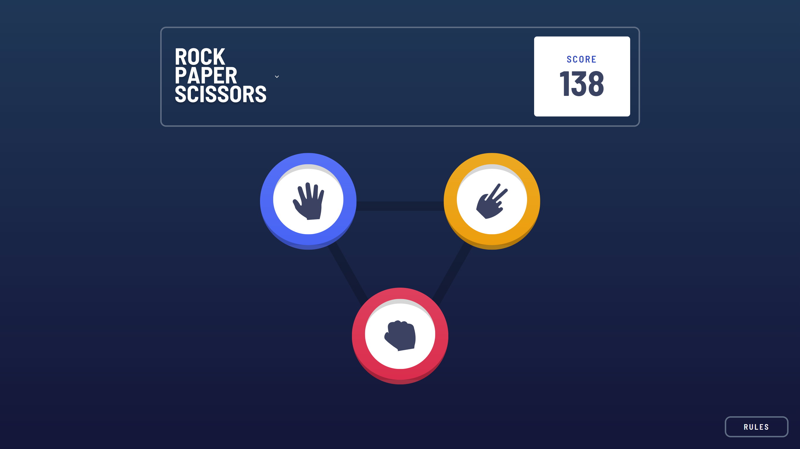
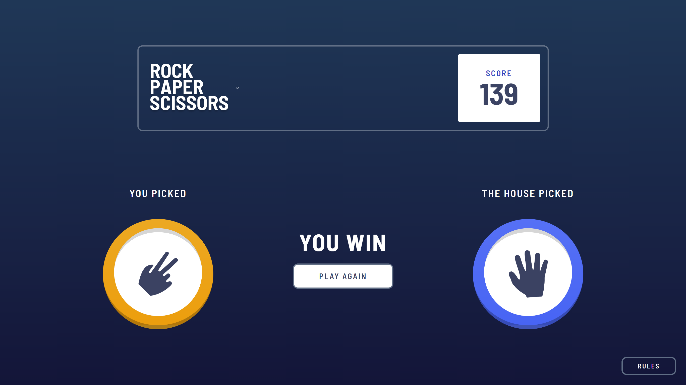
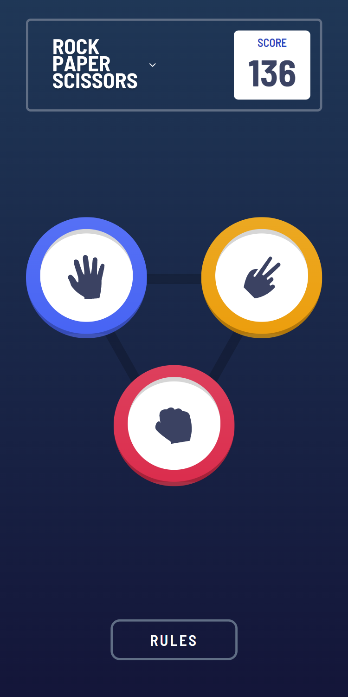
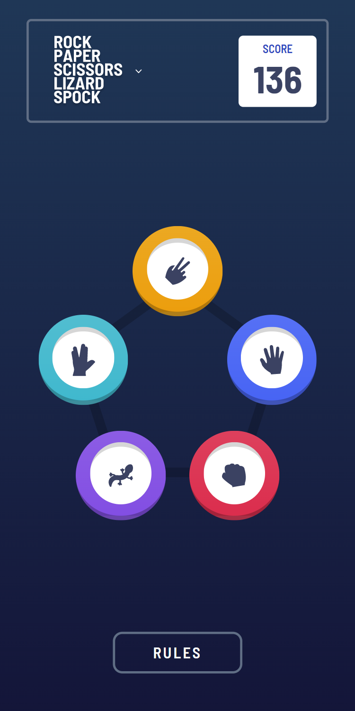
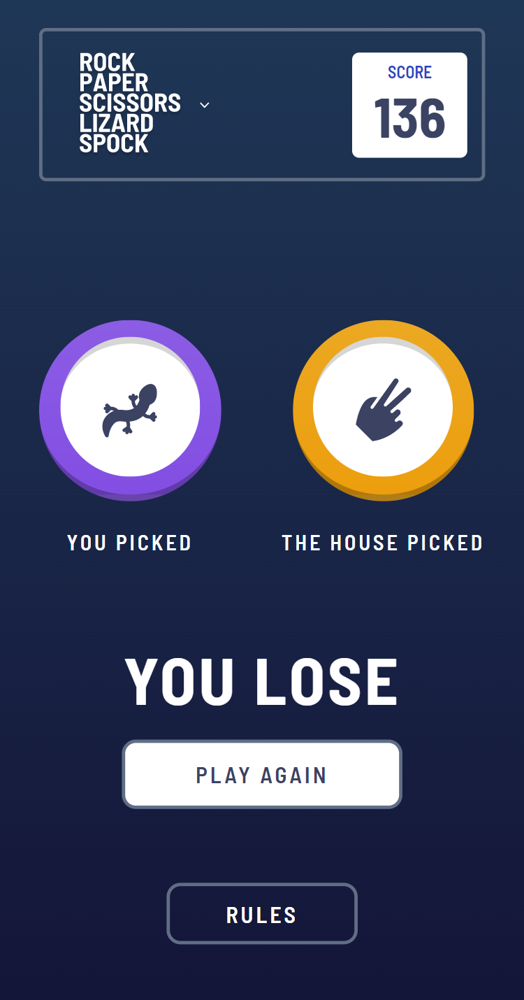

# Frontend Mentor - Rock, Paper, Scissors solution

This is a solution to the [Rock, Paper, Scissors challenge on Frontend Mentor](https://www.frontendmentor.io/challenges/rock-paper-scissors-game-pTgwgvgH). Frontend Mentor challenges help you improve your coding skills by building realistic projects.

## Table of contents

- [Overview](#overview)
  - [The challenge](#the-challenge)
  - [Screenshots](#screenshots)
  - [Links](#links)
- [My process](#my-process)
  - [Built with](#built-with)
  - [What I learned](#what-i-learned)
  - [Continued development](#continued-development)
  - [Useful resources](#useful-resources)
- [Author](#author)

## Overview

### The challenge

Users should be able to:

- View the optimal layout for the game depending on their device's screen size
- Play Rock, Paper, Scissors against the computer
- Maintain the state of the score after refreshing the browser
- **Bonus**: Play Rock, Paper, Scissors, Lizard, Spock against the computer

### Rules

If the player wins, they gain 1 point. If the computer wins, the player loses one point.

#### Original

- Paper beats Rock
- Rock beats Scissors
- Scissors beats Paper

#### Bonus

- Scissors beats Paper
- Paper beats Rock
- Rock beats Lizard
- Lizard beats Spock
- Spock beats Scissors
- Scissors beats Lizard
- Paper beats Spock
- Rock beats Scissors
- Lizard beats Paper
- Spock beats Rock

Not sure what Rock, Paper, Scissors, Lizard, Spock is? [Check out this clip from The Big Bang Theory](https://www.youtube.com/watch?v=iSHPVCBsnLw).

### Screenshots

  
  
_RPS e RPSLS games - Desktop Version_

---

  
  
_RPS e RPSLS games - Mobile Version_

---

### Links

- Solution URL: [https://github.com/Willwf/rock-paper-scissors-game](https://github.com/Willwf/rock-paper-scissors-game)
- Live Site URL: [https://rock-paper-scissors-game-peach.vercel.app/](https://rock-paper-scissors-game-peach.vercel.app/)

## My process

### Built with

- Semantic HTML5 markup
- Typescript
- Flexbox
- Grid
- Mobile-first workflow
- [React](https://reactjs.org/) - JS library
- [Styled Components](https://styled-components.com/) - For styles
- [Vite.js](https://vitejs.dev/) - Bundler JS

### What I learned

This is my first project where I've used TypeScript, aside from some exercises from videos and classes. It has been quite different because unexpected errors occurred due to behaviors that I had not encountered in previous projects. The notes and warnings from the IDE were very helpful to me. Although I am still learning, I have enjoyed using TypeScript. I had to spend some time thinking about the logic to make the game work and had to do a lot of research to make it happen. I had previously used Grid, but in this project, I learned different ways to achieve my desired outcome.

### Continued development

I plan to continue using TypeScript in my future projects to enhance my understanding and broaden my expertise. And I want to start practicing animations using CSS. I feel that would make everything so much more good to see.

### Useful resources

- [ChatGPT](https://openai.com/blog/chatgpt/) - This helped me to explore and utilize many things that I was unfamiliar with. Even when I encountered incorrect responses or outdated information, I was able to extract valuable insights that helped me complete or advance a feature. It's an amazing tool for a student when used well.
- [Stack Overflown](https://stackoverflow.com/) - With the answers I was able to discover and learn a lot of things to make my project work.

## Author

- Github - [William Firmino](https://github.com/Willwf)
- Frontend Mentor - [@Willwf](https://www.frontendmentor.io/profile/Willwf)
- Twitter - [@Williamwf](https://www.twitter.com/Williamwf)
- LinkedIn - [William Firmino](https://www.linkedin.com/in/williamfirmino/)
